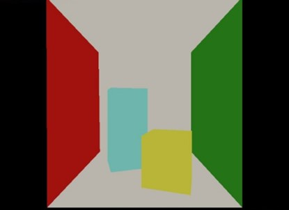
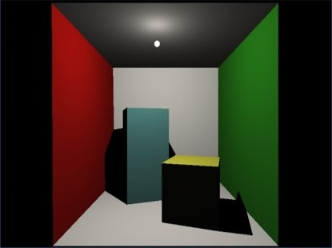
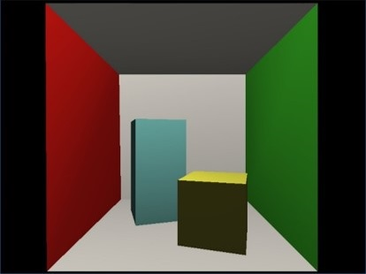
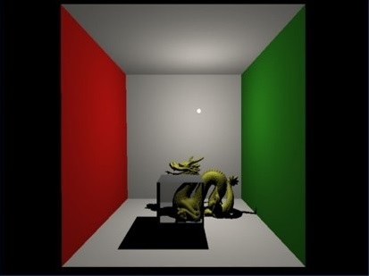
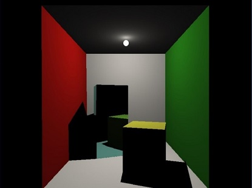

# Ray Tracing API Integration for OpenGL Applications
This repository is a Ray tracing API for OpenGL applications implemented in C++ & OpenCL. Please see below link if you are interested in our work.  

##### [Lai, WH, Tang, CY & Chang, CF 2017, *Ray tracing API integration for OpenGL applications*. in V Skala (ed.), Posters Proceedings. May edn, vol. 2703, University of West Bohemia, pp. 1-5, 25th International Conference in Central Europe on Computer Graphics, Visualization and Computer Vision, WSCG 2017, Plzen, Czech Republic](https://scholar.lib.ntnu.edu.tw/en/publications/ray-tracing-api-integration-for-opengl-applications)

# Motivation
We provide a realtime ray tracing API (RTAPI) integration for OpenGL applications that can replace the original rendering pilepline (rasterization) with ray tracing by simply adding a few lines of code, and the algorithm behind in RTAPI is also fully parallelized by OpenCL.

|                 `Original` OpenGL Applications                  |                      `RTAPI` OpenGL Applications                                 |
| :-------------------------------------------------------------: | :------------------------------------------------------------------------------: |
|   <br/> Conell box w/ light diabled  |  <br/> Ray tracing is applied automatically           |
|  <br/> Conell box w/ light enabled |      <br/> Refraction material extension in RTAPI     |
|                                                                 |  <br/> Mirror Reflection material extension in RTAPI  |


# Supported Fixed Function Pipeline Calls
These calls are commonly used in fixed function pipeline, you can simply include the *RayTracing.h* and these calls are automatically transformed to RTAPI. Note that the extension column represents some features only provided by RTAPI which legacy OpenGL does not support.

| Buffer       | Rendering       | Capability           | GLU <br/>(OpenGL Utility Library) | Lighting  | Extension            |
| ------------ | --------------- | -------------------- | --------------------------------- | --------- | -------------------- |
| glGenBuffers | glVertexPointer | glEnableClientState  | gluPerspective                    | glLightfv | rtMaterialEXT        |
| glBindBuffer | glColorPointer  | glDisableClientState | gluLookAt                         |           | rtBuildAcclStructEXT |
| glBufferData | glNormalPointer | glEnable             |                                   |           |                      |
|              | glDrawArrays    | glDisable            |                                   |           |                      |
|              | glFlush         |                      |                                   |           |                      |

# Prerequisite

* OpenCL >= 1.2 and its Installable Client Driver (ICD)
  * Windows 10 PC
    * Using Intel iGPU, your Graphic driver is already included or you can update it from [Intel Download Center](https://downloadcenter.intel.com/product/80939).
    * Using NVIDIA GPU, please install the latest [NVIDIA Graphic Driver](https://www.google.com/url?sa=t&rct=j&q=&esrc=s&source=web&cd=&cad=rja&uact=8&ved=2ahUKEwiD2Mb8yvXuAhXGF3IKHe2KDC8QFjACegQIEBAD&url=https%3A%2F%2Fwww.nvidia.com%2FDownload%2Findex.aspx&usg=AOvVaw3QMyvvhtDESOcvPBtma4SH).
  * Linux PC (Ubuntu >= 16.04)
    * Using Intel iGPU, please install via this command `sudo apt install intel-opencl-icd`
    * Using NVIDIA GPU, please install via this command `sudo apt install nvidia-opencl-icd`
* CMake >= 3.7
* Git
* GCC (Linux)
* make (Linux)
* Visual Studio 2015 Update 3 or greater with the English language pack (Windows)

# Build from Scratch
#### Checkout the source tree:
```sh
> git clone --recursive https://github.com/RuinedStar/Ray-Tracing-API-Integration.git
> cd Ray-Tracing-API-Integration
```
### **Windows**
    
#### Install 3rd-party libraries using vcpkg

```cmd 
> cd vcpkg
> .\bootstrap-vcpkg.bat
> .\vcpkg.exe install --triplet x64-windows opencl assimp devil freeglut glew glm
```
#### Generate your Visual Studio project 
* CMake-GUI or follow commands in [Linux build section](#configure-and-build-your-project)
* Double click raytracing.sln to open Visual Studio IDE and start to play it around! 
    
### **Linux**
#### Install 3rd-party libraries using vcpkg
```sh
> cd vcpkg
> ./bootstrap-vcpkg.sh
> ./vcpkg install --triplet x64-linux opencl assimp devil freeglut glew glm
```
#### Configure and build your project
```sh
> cd ..
> mkdir build
> cd build
> cmake ..
> make -j$(nproc)
```
# Special Thanks
My classmate, *C.Y Tang*

The College Advisor,  *C.F Chang* 
